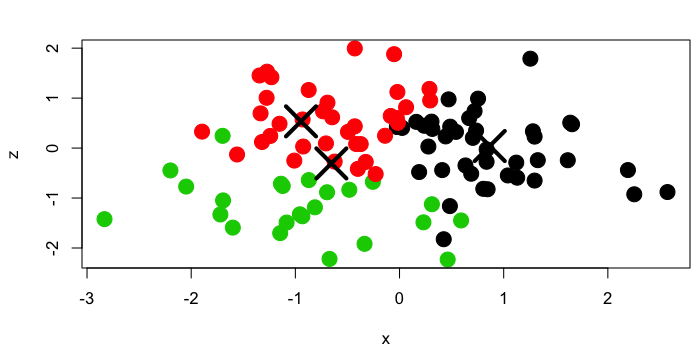

## k-means clustering

kmeans is a method to partition n observations into k clusters where each observation belongs to the cluster with the nearest mean.


$$
\underset{s}{argmin} \sum^{k}_{i=1} \sum_{x \in S_i} ||x-\mu_i||^2
$$


This is a sample application to demonstrate k-means method, applied on 2D randomly generated data. 

Source: [http://en.wikipedia.org/wiki/K-means_clustering](http://en.wikipedia.org/wiki/K-means_clustering)

--- .class #id

## Data

The dataset that I use for this clustering app is a set of x and y that are consists of 100 normal random variables:


```r
x <- rnorm(100)
y <- rnorm(100)
z <- rnorm(100)
dataset <- data.frame(x,y,z)
```

The data set can be changed to any other datasets available. using the Clusters selection bar in the application, we can adjust the number of clusters that we would like to consider in our dataset.

--- .class #interactive 

## k-means clustering detector app

The interactive part of this app allows the user to pick the variables that they want to plot. Also it permits to choose the number of clustering. [https://mkhalegh.shinyapps.io/kmeans/](https://mkhalegh.shinyapps.io/kmeans/)

<div class="row-fluid">
  <div class="container-fluid">
    <div class="row">
      <div class="col-sm-4">
        <div class="form-group shiny-input-container">
          <label class="control-label" for="xcol">X Variable</label>
          <div>
            <select id="xcol"><option value="x" selected>x</option>
<option value="y">y</option>
<option value="z">z</option></select>
            <script type="application/json" data-for="xcol" data-nonempty="">{}</script>
          </div>
        </div>
      </div>
      <div class="col-sm-4">
        <div class="form-group shiny-input-container">
          <label class="control-label" for="ycol">Y Variable</label>
          <div>
            <select id="ycol"><option value="x">x</option>
<option value="y" selected>y</option>
<option value="z">z</option></select>
            <script type="application/json" data-for="ycol" data-nonempty="">{}</script>
          </div>
        </div>
      </div>
      <div class="col-sm-4">
        <div class="form-group shiny-input-container">
          <label for="clusters">Cluster count</label>
          <input id="clusters" type="number" class="form-control" value="3" min="1" max="9"/>
        </div>
      </div>
    </div>
    <div class="row">
      <div id="kmeans" class="shiny-html-output rChart"></div>
    </div>
  </div>
</div>


--- .class #id

## Example:

Here is an example plot of the kmeans clustering using **rCharts** :

<iframe src=' fig/unnamed-chunk-3-1.html ' scrolling='no' frameBorder='0' seamless class='rChart polycharts ' id=iframe- chart2d64d5fde0c ></iframe> <style>iframe.rChart{ width: 100%; height: 400px;}</style>

 **Note:** in `rPlot` there is no `X` symbol, so I used black circle for the centers of the clusters.

--- .class #id

## example output of the application

Here is an example plot of the application:


```r
clusters <- kmeans(dataset, 3)
par(mar = c(4.1, 4.1, 2, 0.5))
plot(x,z, col = clusters$cluster, pch = 20, cex = 3)
points(clusters$centers, pch = 4, cex = 4, lwd = 4)   
```

<div class="rimage center"></div>
